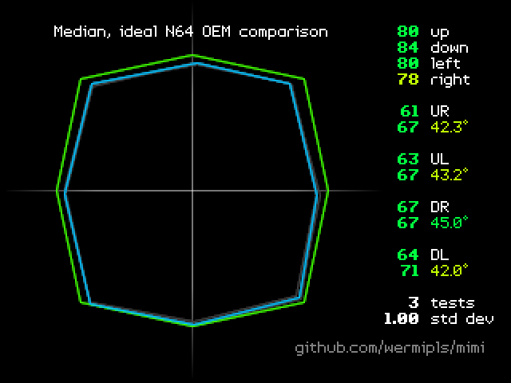

# mimi


**mimi** is a controller test rom for Nintendo 64. It's heavily inspired by [sanni's controllertest](https://github.com/sanni/controllertest/tree/master/N64-Port) and [max257612's fork thereof](https://github.com/max257612/controllertest), however it is written completely from scratch. Differences include improved graphics, ability to take multiple measurements, improved judgement of ranges, additional information on result screen, more extensible codebase, as well as various UX improvements.

If you use this software commercially (e.g. to provide measurements for the controllers you sell), consider buying me a Ko-fi.

[](https://ko-fi.com/B0B37GRPD)

## Download
Latest version of the ROM can be found [here](https://github.com/wermipls/mimi/releases).

## Basic controls
In the main menu:
* D-Pad - select option
* A - confirm selection

On the help screen:
* D-Pad Left/Right or L/R - change page
* A/B - return to main menu

On the range test result screen:
* L/R - switch between range comparisons
* D-Pad Up/Down - switch between measurements
* D-Pad Left/Right - switch between example ranges and result measurements
* Z - change zoom
* Start - return to main menu

Additional informations on usage can be found in the help screen built into the ROM.

## Building
To build the ROM, you will need to have [libdragon](https://libdragon.dev/) set up. 

Clone the repository (including submodules) and navigate to the directory:
```
git clone --recurse-submodules
cd mimi
```

For initial build:
```
libdragon init
libdragon make
```

After that, the ROM should be possible to compile with just `libdragon make`.

## Credits
* wermi - main code and graphics
* kolunio - testing, minor improvements and code review

Special thanks to adelyn, alaris, Bailey, billy, egasyelir, GiBoss, jwaterman, Kyman, Manama, MontyVR, nim, Tabascoth, Taki and tayyip.

### 3rd party assets
* [Enter Command font by Font End Dev](https://fontenddev.com/fonts/enter-command/), licensed under CC BY 4.0

## License
MIT
